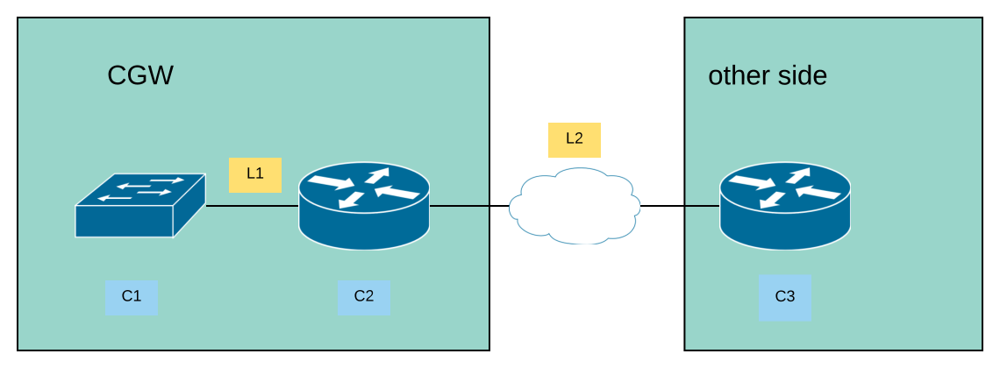
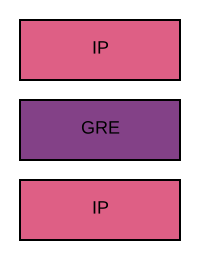
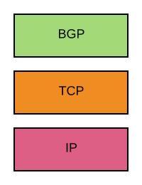
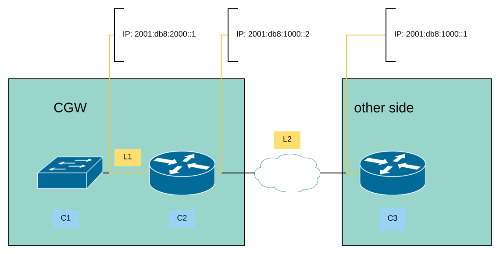

# Announced default route by other party using BGP

As shown in the overview, the architecture consists of routers on our side as
well as the side of the other party.



## Traffic between the routers

`L2` as shown in the overview can either be a direct connection to the other
router, meaning a direct point-to-point link or could also be implemented over
a tunneling protocol like GRE.

In the first case the connection could either be implemented as a direct cable
or fibre, a switched network or even a virtual link over MPLS.

For the CGW the stack of protocols in `L2` looks the same though.

The payload traffic in the first case consists only of IP packets.

The payload traffic in the case of GRE as an example for a tunneling protocol
looks as follows:



In general all behaviours of a routed networks apply here.

To exchange the route tables and be able reach networks beyond C3, the BGP
protocol will be used, which network stack looks as follows.



The two routers `C2` and `C3` will announce their respective routes and the
used software in the routers, in case of the CGW it is `bird` will add the
routes to the kernel routing table.



In the most simple case the router `C2` will announce its local network to
router `C3` and router `C3` will announce the default route to `C2`.

Therefore, all traffic comming from the VXLAN `C1` will be routed to `C3`.

The resulting table on `C2` will look as follows:

```
2001:db8:2000::/64 via L1
::/0 via 2001:db8:1000::1
```

The resulting table on `C3` will look as follows:

```
2001:db8:2000::/64 via 2001:db8:1000::2
... other interfaces
```
