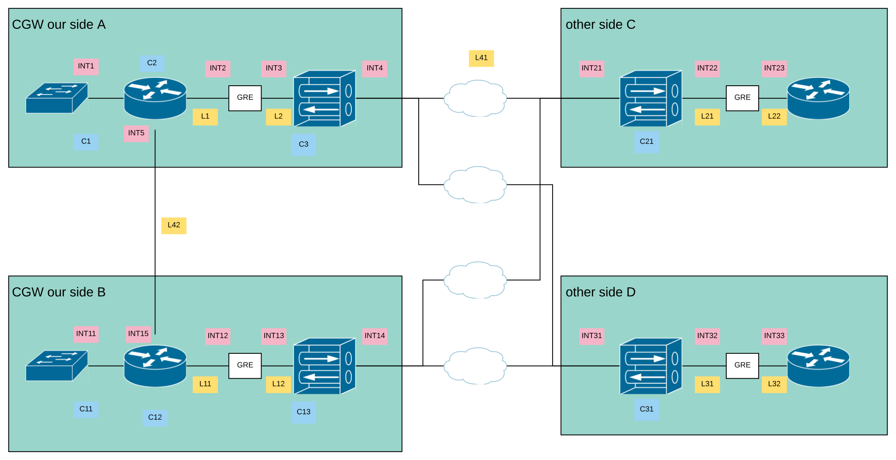

# High available routed attachment over VPN secured links with liveliness probes (MODEL-7)

As this is the currently mode complicated model, I assume, that you have read
the documentation on [MODEL-1](./s2s-route-based-vpn.md) and [MODEL-2](./bgp-default-route.md)
first, to get a basic understanding of the underlying components beeing BGP
routing and IPSEC VPN termination.

The following picture shows the overall architecture and labels the links as
well as the componentes and interfaces.
To document will explain what protocols are running on which links and how
they are stacked.
This will be useful if debugging becomes necessary.

