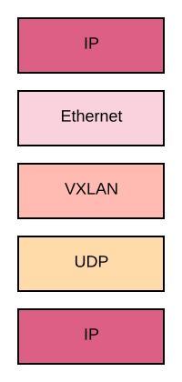
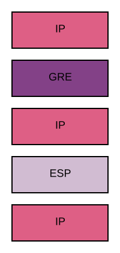

# High available routed attachment over VPN secured links with liveliness probes (MODEL-7)

As this is the currently mode complicated model, I assume, that you have read
the documentation on [MODEL-1](./s2s-route-based-vpn.md) and [MODEL-2](./bgp-default-route.md)
first, to get a basic understanding of the underlying components beeing BGP
routing and IPSEC VPN termination.

The following picture shows the overall architecture and labels the links as
well as the componentes and interfaces.
To document will explain what protocols are running on which links and how
they are stacked.
This will be useful if debugging becomes necessary.

## Routed Traffic in CGW

We will start the tour through the protocol stack in CGW Side A on the left
side at C1.
In this case as in MODEL-1 the VXLAN we use to connect to the other network
functions is drawn as a switch, as the VXLAN actually works as a Layer 2
network running over Layer 3.

Incoming packets from the VXLAN on interface `INT1` will then be decapsulated
and to go through the routing engine of the kernel.
If the packets are targeted to networks on the other side (behind C or D), the
way depends on the priority of the router A vs router B.

In case router B has the higher priority, the packets will be sent over `INT5`
to `INT15` on router B and the routing step will be repeated there.

In the more simple case for this description, router A has the priority and
the packet will be routed to this router.

## GRE

Now it depends, whether *GRE* has to be used as a tunneling protocol or not.
It is possible to not use *GRE* when both ends (side A and B as well as C and
D) do support VTI interfaces and assign the correct IP addresses to the
interfaces.
Further tunneling IPv4 and IPv6 over the same VTI interface is not yet
supported on Linux.

Due to incompatibilities between the different routers and different specs of
what is supported, *GRE* has to be used in a lot of cases to provide a virtual
point to point link.
*GRE* is a well suited protocol for this use cases.
The drawback is though, that additional computation has to be done and the MTU
is reduced by 4-16 bytes for the GRE header and an additional IP header.

The virtual *GRE* interface does have an inner IP address ( on `INT2`) as well
as an outer IP address ( on `INT3`).
This is common to all tunnel protocols.
In this setup, `INT3` is the VTI interface of the tunnel (see MODEL-1).

In the case *GRE* is used, the packet will be routed via the IP of `INT23` and
therefore through interface `INT2` of CGW A.
The packets will be encapsulated in a GRE header and an additional IP header.

## Encryption

After that the packet is routed to the other side of the VTI peer-to-peer
link, but because it is a static route in the kernel and has not to be
changed by the user, I will omit the details in the graphic.

The packet is then ecapsulated and encrypted in the ESP header and send over
the internet to the other side.

In this example, we assume, that side C has the higher preference and
therefore the packet layers on L41 between `INT4` and `INT21` is the
following:

The bottom IP header contians the IP of `INT4` as the source address and the
IP of `INT21` as the destination address.
The middle IP header contains the IP of `INT3` as the source address and the
IP of `INT22` as the destination address.
The top IP header contains the IP of the source network function on our side
as the source address and the IP of the destination on the other side as the
destination IP address.

On side C, the packets are first decripted, then decapsulated and reach then
the routing function of the other side and will be routed to the destination.

## High availability

If you have not already, pleas read the articles on
[Routing basics](../routing_basics.md) and
[Bidirectional Forwarding Detection](../bfd.md) first.

In this setup any one of the CGWs or connecting functions on the other side,
as well as every one of the connections can fail and the setup will still
provide connectivity.

To ensure this, the routers on each side are connected to two routers on the
other side.
On of the local routers, as well as one of the other routers will have a
preference.
In the case that all routers are active, only one on each side will
actually transfer traffic.

There are other confiugurations using ECMP but this will not be considererd
here.

In the case the preferred router dies, the traffic will be routed over the
spare router.
This failure can either be detected by BGP itself or by BFD which takes
considerable less time.

In the case of a connection loss of the preferred router to both routers of
the other side, it is still able to forward traffic for the internal network,
but will so over the secondary router.
This behaviour assumes, that the internal network does not run IGP protocols.
