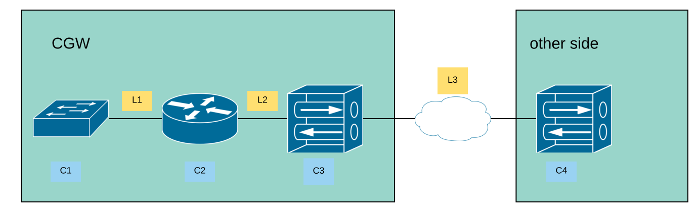
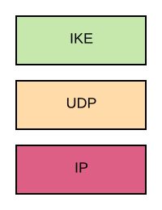
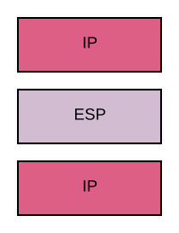
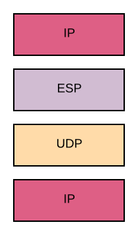
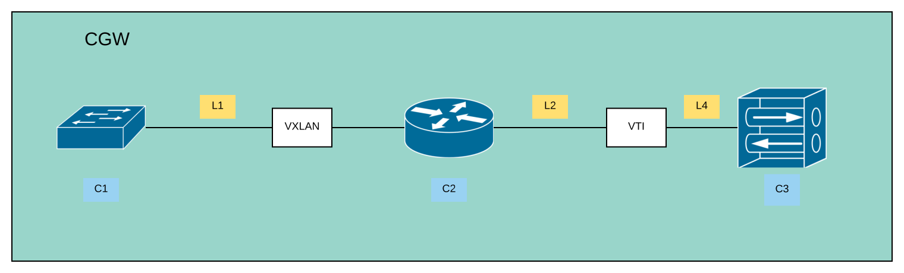

# MODEL-1 Site to Site route based VPN using IPSEC (MODEL-1)

## Overview

In the following picture, you see the overall architecture of this model and
the functions on each part.

### Protocol over the internet

As shown in the picture above, the archtitecture of a simple VPN connection
consists of two sides, ours (left) where the CGW is implementing the
functionality and the other side (right), where we do not care, how the
functionality is implemented.

Further the link `L3` connects both sides over a network or even the internet.

On both sides the function to connect each other is a VPN concentrator (`C3`
and `C4`).

The protocol stacks are can be different depending on the circumstances.

In general all key management is handled by the IKE protocol.
Over this protocol, the keys are exchanged, the cyphers are selected and the to be encapsulated networks
are choosed.

After the setup of the connection, the IP traffic is encrypted and sent over
the tunnel between the two concentrators.

In the case of a public IP address of the concentrators and no filters in
between, the ESP packet is directly transferred as an IP payload, whereas it
is encapsulated by UDP in the case NAT is detected or a direct connection is
not working.

### CGW internal functions

As seen in the graph, the CGW implements multiple functions in one Pod and
therefore also on one network namespace.

As shown in the picture, the CGW implements two interfaces to connect to both
sides.
One is a *VXLAN* interface, this is normally managed by *vxlan-controller*. It
creates a virtual ethernet segment between the connected pods.
Therefore it is here shown as a switch (`C1`).

The protocol stack is shown below:

The second interface is the *VTI* or *Virtual Terminal Interface*.
This is only existing if [route-based VPN](../policy_route_based_vpn.md)
is choosen as the mode for the VPN.

The VTI interface implements a virtual tunnel interface.
The tunnel is virtual in the sense, that there are no tunnel protocols run on
link `L4`.
Never the less, both sides of the virtual tunnel have an IP address.
The one of the other side can then be used, to route traffic to this side by
utilising the routing functionality of the linux kernel.

To be able to route traffic from the VXLAN to the VTI interface, routes for
the other side of the VPN tunnel have to be added to the routing table
manually.
Further the routes have to be configured in all pods or this CGW has to be
added as the default router.

Attention:
In case of IPv6 Router Advertisement can be used to announce the routes to
other pods in the VXLAN networks.

