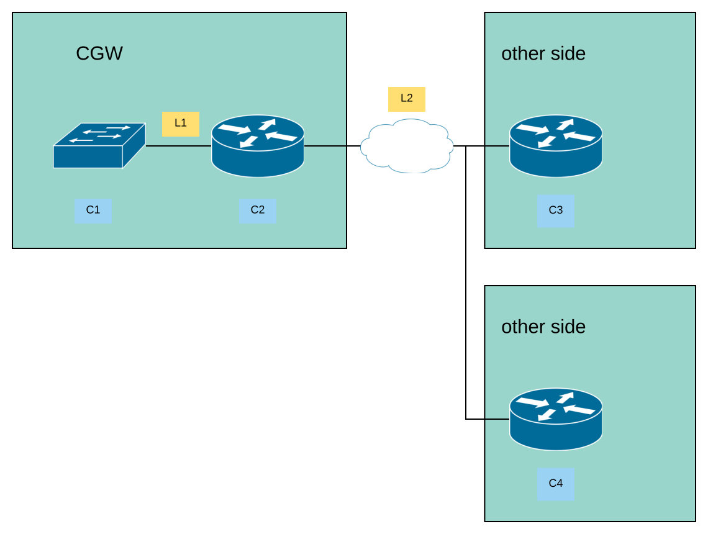

# Routing Basics

For announcing routes to external partners, we use the BGP protocol (Border
Gateway Protocol).
Using this, the routers connect and create a session and announce network
prefixes.

As an example, the router `C2` in the picture above would announce the prefix
`2001:db8:2000::/64` via `2001:db8:1000::2`.

The router `C3` would announce the networks connected to the router and not
shown in the picture to router `C2`.
Further `C3` would annouce networks, which are not directly connected to the
router, but reachable via other routers connected to router `C3` and so forth.

Going further into the mechanics of the route selection is beyond the scope of
this article.

## Routing Preferences

When multiple routers are connected to one router, it does make sense to also
announce, which router is preferred.

One way to do it is to set a local preference of the router in the BGP
configuration.
The router with the highest preference will be selected.
The drawback is though, that our side would decide, which router to prefer and
not the other side, although they might have the need to change the value
during maintanence.

The second option to select one router over the other is to send a *MED* value
(Multi-Exit Discriminator).
If both router have the same preferrence based on other values, the one with
the lowest MED value will be selected.
The MED value is transmitted via the BGP protocol.

